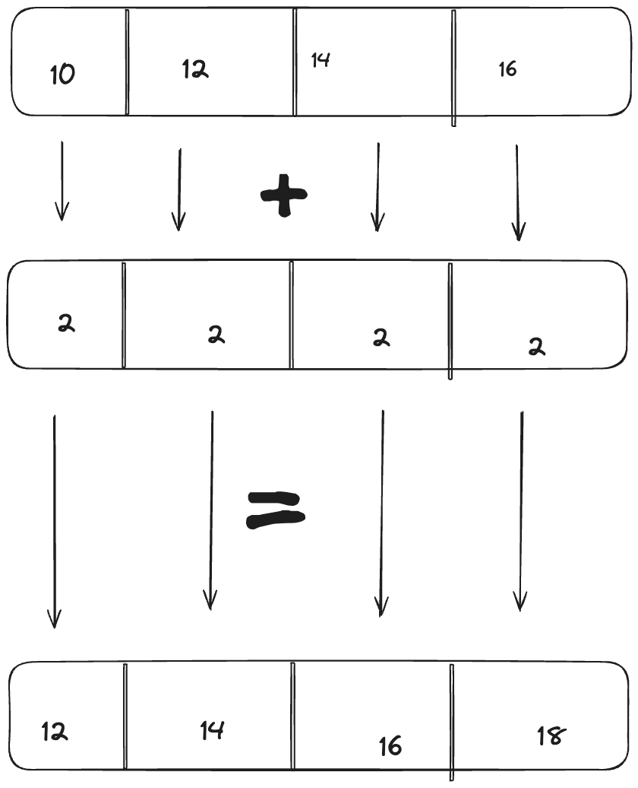

I have been on a study of SIMD algorithms for the past few weeks, to understand how developers adapt and tweak serial algorithms to take advantage of SIMD hardware. In this post, In this series, I will explore a small piece of a library that exploits SIMD hardware in commodity processors on laptops and desktops to accelerate base64 encoding and decoding, [fastbase64](https://github.com/lemire/fastbase64) courtesy [Prof Lemire](https://lemire.me/blog/), who has worked on many libraries to accelerate common text processing tasks , such as parsing [JSON](https://github.com/simdjson/simdjson) and [UTF](https://github.com/simdutf/simdutf) parsing

# A Brief introduction to SIMD

SIMD stands for : Single Instruction Multiple Data.

Essentially it is a special set of hardware execution units and registers on processors that can perform the same operation on multiple units of data at the same time. 

#### Without SIMD
Take for example a simple loop to element-wise sum 2 arrays
```

for(int i=0; i < n; i++) {
   dest[i] = a[i] + b[i]
}
```
The processor would execute addition element by element , something like the loop below
```
`; Assuming: 
; rdi = pointer to dest array 
; rsi = pointer to a array 
; rdx = pointer to b array 
; rcx = n (number of elements)     
xor r8, r8          ; Initialize loop counter (i) to 0 
.loop:     
	cmp r8, rcx         ; Compare i with n    
	jge .done           ; If i >= n, exit loop     
	mov eax, [rsi + r8*4] ; Load a[i] into eax    
	add eax, [rdx + r8*4] ; Add b[i] to eax    
	mov [rdi + r8*4], eax ; Store result in dest[i]     
	inc r8              ; Increment loop counter    
	jmp .loop           ; Continue loop .done:     
; Loop finished`
```

The compiler is smart enough to unroll the loop at times, so that it runs faster but we are still adding only one index (a[i] + b[i]) at a time. 

#### With SIMD

The processor provides special SIMD registers. The registers are (atleast today) 128, 256, 512 bits or more wide. The registers are split into **lanes** that can be 8, 16, 32 or 64 bits wide. We provide one instruction that operates on all of the lanes at once.

In the following example, we are splitting 128 bit register into 4 lanes, 32-bits each and then element wise adding them.



Elementwise addition is not the only operation supported, other ops like multiplication , sub, trig fns are also supported depending on the processor. 

In this series, I will restrict myself to x86-64 processors (both Intel and AMD) supporting the AVX2 instruction set. 

x86 has multiple versions of SIMD instructions and registers. The oldest is MMX, followed by SSE, then AVX/AVX2 and AVX-512 and family of instructions. 
MMX had 64-bit wide registers and supported only integer operations, while SSE added 128-bit registers and supported floating point arithmetic. AVX increased the register sizes to 256 bits and AVX-512 expanded the register size to 512 bits. Each generation added newer instructions to manipulate the registers. The [Wikipedia](https://en.wikipedia.org/wiki/Advanced_Vector_Extensions) article is a good summary of the various instruction sets and capabilities.

### How to use SIMD ? 

SIMD instructions make use of SIMD registers that are 128,256 or 512 bits. The instruction set provides various instructions to manipulate the registers. AVX2 for example provides 16 256 bit registers, named ymm0-ymm15. 
Each instruction works on one or more register and produces a result. 
To use these instructions, we could use inline asm in our code to emit the assembly instructions directly, or we could enable optimisation flags in our compiler (-O2, -O3 etc) and pray that the compiler is smart enough to generate the optimisations to use these instructions. 

There is also a 3rd option: using [intrinsics](https://www.intel.com/content/www/us/en/docs/cpp-compiler/developer-guide-reference/2021-8/intrinsics-for-avx2.html). These are architecture specific datatypes and header files that provide functions and datatypes to manipulate the SIMD registers by using using SIMD instructions. 

On x86-64 Linux, the header file `#include <immintrin.h>` (or `<x86intrin.h>`) provides the `_mm256i` datatype that represents a 256-bit register. The header file also provides a `_m256i_add_epi32` fn  that (among many others) takes 2 `_mm256i` arguments, each having 8 lanes of 32-bit signed integers and adds them lane wise. You can visualise this as the diagram above having 8 instead of 4 lanes in each register and then pairwise adding them. 

A second arithmetic function provided by the intrinsics library is `__m256i _mm256_mulhi_epi16(__m256i s1, __m256i s2);` This fn splits each register as 16 16-bit values and then element-wise multiplies them. Since multiplying 2 16-bit values can produce upto a 32-bit value, the `mulhi` part of the instruction instructs the CPU to only store the high 16 bits of each result, while discarding the lower 16-bits. 

```
ymm0 = {0x00 0x48 0x40 0x0f 0x00 0x64 0x40 0x06 0x00 0x70 0x00 0x0c 0x00 0x74 0x00 0x05 0x00 0x60 0x40 0x0c 0x00 0x6c 0x40 0x00 0x00 0x64 0x40 0x04 0x00 0x6c 0x40 0x00}
    

ymm7 = {0x40 0x00 0x00 0x04 0x40 0x00 0x00 0x04 0x40 0x00 0x00 0x04 0x40 0x00 0x00 0x04 0x40 0x00 0x00 0x04 0x40 0x00 0x00 0x04 0x40 0x00 0x00 0x04 0x40 0x00 0x00 0x04}
    

The register values are stored in little endian, so 0x00 0x48 is 0x4800. 0x40 0x00 is 0x0040. The 2 multiplied, first 2 bytes are 0x12 00, which are set
    
7. output = ymm2 = {0x12 0x00 0x3d 0x00 0x19 0x00 0x19 0x00 0x1c 0x00 0x30 0x00 0x1d 0x00 0x14 0x00 0x18 0x00 0x31 0x00 0x1b 0x00 0x01 0x00 0x19 0x00 0x11 0x00 0x1b 0x00 0x01 0x00} = t1
```

Arithmetic is not the only type of instruction. There are other bit manipulation instructions that will come to use later, that are supported. One of the instructions is the `shuffle` instruction (vpshub). This instruction is represented by the `__m256i _mm256_shuffle_epi8(__m256i a, __m256i b)` intrinsic. 

Shuffle instruction shuffles or reorders the elements in a source register (a) based on a `mask` register (b).if the results are written to register r and assuming b[i] =j, then r[i] = a[j] (value at index j of a is written to index i of output, hence the name **shuffle**)

```
Lookup Table: {0x00 0x00 0x00 0x00 0x48 0x6f 0x77 0x65 0x76 0x65 0x72 0x2c 0x20 0x77 0x65 0x20 0x61 0x6c 0x73 0x6f 0x20 0x6f 0x66 0x74 0x65 0x6e 0x20 0x75 0x73 0x65 0x20 0x74}
    
mask = {0x05 0x04 0x06 0x05 0x08 0x07 0x09 0x08 0x0b 0x0a 0x0c 0x0b 0x0e 0x0d 0x0f 0x0e 0x01 0x00 0x02 0x01 0x04 0x03 0x05 0x04 0x07 0x06 0x08 0x07 0x0a 0x09 0x0b 0x0a}

output = {0x6f 0x48 0x77 0x6f 0x76 0x65 0x65 0x76 0x2c 0x72 0x20 0x2c 0x65 0x77 0x20 0x65 0x6c 0x61 0x73 0x6c 0x20 0x6f 0x6f 0x20 0x74 0x66 0x65 0x74 0x20 0x6e 0x75 0x20}

Note that mask[0] = 0x5, hence output[0] = Lookup Table[0x5]
```

The Shuffle instruction is very useful as a lookup table. You can fill the `mask` registers with indexes that you want to lookup and `a` be the lookup table. Assuming 256-bits or 512-bit registers and 1 byte indexes, you can have a 32 / 64 entry table WITHOUT HAVING TO TOUCH THE MEMORY OR THE CACHE AT ALL !

The last instruction I want to talk about is the Masked Load instruction. Lets deconstruct the words a bit:
1. load - load data from memory
2. masked - provide a `mask` to control the loading. But how ? 

```
int main() {
  char* s = "Mr batman, Mr batman, jungle man, spiderman";
  printf("%s\n", s - 12);
}
```

The access to address `s-12` is might be invalid (as we didn't allocate the memory to any variable). The program might raise a segfault and get terminated due to illegal memory access.

Another case that comes up is loading the last few bytes of an array whose size is not a multiple of 8, 16, or 32. 

Eg, lets try to sum up 2 arrays of  38 integers each.
```
#include <x86intrin.h>
#include <stdbool.h>
#include <stdint.h>
void print_mm256i(__m256i var) {
  uint32_t val[8];
  _mm256_storeu_si256((__m256i*)val, var);
  printf("__m256i: [");
  for(int i = 0 ; i < 8; i++) {
    printf("0x%08X", val[i]);
    if(i < 8) printf(", ");
  }
  printf("]\n");
}

int main() {
  int a[38] = {[0 ... 37] = 17};
  int b[38] = {[0 ... 37] = 19};
 for(int i =0; i < 38;i += 8) {
    __m256i inputa = _mm256_loadu_si256(a + i);
    __m256i inputb = _mm256_loadu_si256(b + i );
    __m256i result = _mm256_add_epi32(inputa, inputb);
   print_mm256i(result);
  }
  return 0;
}
```
There is one small problem in the code: In the last run of the loop, We are accessing indexes beyond `a + N`  (idx 38 and 39) which might result in a segfault. Even if we don't get segfaults, the result of adding the values of a[39] and b[39] might be total garbage

```
 __m256i: [0x00000024, 0x00000024, 0x00000024, 0x00000024, 0x00000024, 0x00000024, 0x00000024, 0x00000024, ]
    
 __m256i: [0x00000024, 0x00000024, 0x00000024, 0x00000024, 0x00000024, 0x00000024, 0x00000024, 0x00000024, ]
    
__m256i: [0x00000024, 0x00000024, 0x00000024, 0x00000024, 0x00000024, 0x00000024, 0x00000024, 0x00000024, ]
    
__m256i: [0x00000024, 0x00000024, 0x00000024, 0x00000024, 0x00000024, 0x00000024, 0x00000024, 0x00000024, ]
    
__m256i: [0x00000024, 0x00000024, 0x00000024, 0x00000024, 0x00000024, 0x00000024, 0x79758C30, 0xBE4B62BA, ]

Array values in hexadecimal. Notice that the last 2 values are garbage whereas all the other values are the result of adding 17 + 19 = 36 (0x24)
```
 

There are 2 options:
1. Have a separate loop for loading the last few elements of the array that are not divisible by 8 (that is, set `i< 32` and load elements 32...37 in a separate loop)
2. Use a `masked load`

A Masked load takes a `mask` vector alongside the pointer to load data from. The mask is a vector/array of 1/0 values that control if element at that index from the source pointer must be loaded
For example,
if mask = [1, 1, 1, 0, 0, 0, 0, 0]
then `res = masked_load(a, mask)` will only load `a[0], a[1] and a[2]`. `res[3..7]` will be set to 0 and any segfault that occur due to accessing `a[3..7]` will be suppressed

```
void add_with_masking(int* a, int* b, int N) {
 for(int i =0; i < N;i += 8) {
     int elements_to_load = ((i + 8) < N) ? 8: N % 8;
     __m256i mask_for_loading = generate_load_mask(elements_to_load);
    __m256i inputa = _mm256_maskload_epi32(a + i, mask_for_loading);
     __m256i inputb = _mm256_maskload_epi32(b + i, mask_for_loading);
    __m256i result = _mm256_add_epi32(inputa, inputb);
    printf("\nresult");
    print_mm256i(result);
  }
}

Output:
result__m256i: [0x00000024, 0x00000024, 0x00000024, 0x00000024, 0x00000024, 0x00000024, 0x00000024, 0x00000024, ]

result__m256i: [0x00000024, 0x00000024, 0x00000024, 0x00000024, 0x00000024, 0x00000024, 0x00000024, 0x00000024, ]

result__m256i: [0x00000024, 0x00000024, 0x00000024, 0x00000024, 0x00000024, 0x00000024, 0x00000024, 0x00000024, ]

result__m256i: [0x00000024, 0x00000024, 0x00000024, 0x00000024, 0x00000024, 0x00000024, 0x00000024, 0x00000024, ]

result__m256i: [0x00000024, 0x00000024, 0x00000024, 0x00000024, 0x00000024, 0x00000024, 0x00000000, 0x00000000, ]

Notice that the last 2 indexes have 0 as the resultant value since we do not load their corresponding source operands from a and b
```

When loading elements from a and b, we generate a mask vector where for all indexes < N  mask[index] = 0x8000 or 0 otherwise. This way, we can ignore index > N without raising any segfaults. The fn `generate_load_mask(n)` generates a `mask` vector of 8 32-bit elements, again using SIMD instructions


```
 __m256i generate_load_mask(int n) {
    __m256i index = _mm256_setr_epi32(0, 1, 2, 3, 4, 5, 6, 7);
    __m256i n_vector = _mm256_set1_epi32(n);
    __m256i mask = _mm256_cmpgt_epi32(n_vector, index);
    __m256i result = _mm256_and_si256(mask, _mm256_set1_epi32(0x80000000));
    return result;
}
```

On an input of `n=6`, we first set `index` = [0, 1, 2, 3, 4, 5, 6, 7]. 
`n_vector` repeats n 8 times: [n, n, n, n, n, n, n, n];
`_mm256_cmpgt_epi32` compares each element in `n_vector` with `index` and set each lane to 1 if n > index  or 0 otherwise
The mask is thus `[1, 1, 1, 1, 1, 1, 0, 0]`. `_mm256_and_si256` does a logical `AND` of 2 vectors: the `mask` vector and a vector of constant `0x80000000`, thus resulting in a vector 
`[0x80000000, 0x80000000, 0x80000000, 0x80000000, 0x80000000, 0x80000000, 0, 0]`

Thus in the last loop, loading from `i=32..40` we can thus mask out the loads to `a[38, 39` and `b[38, 39]` by using masked loads ! 

I hope I didn't complicate this too much! SIMD might look hard, but the fundamentals of it are relatively simple. This article covered the basic instructions and features of SIMD architectures/instruction sets. In the upcoming series of articles, we can see how we can use SIMD to accelerate a lot of commonly done computing tasks: Such as encoding/decoding and counting elements in a set ! 

